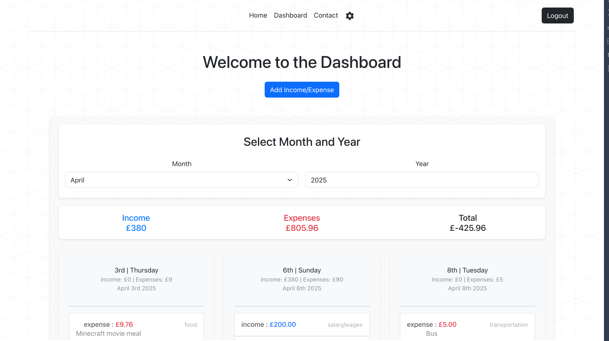
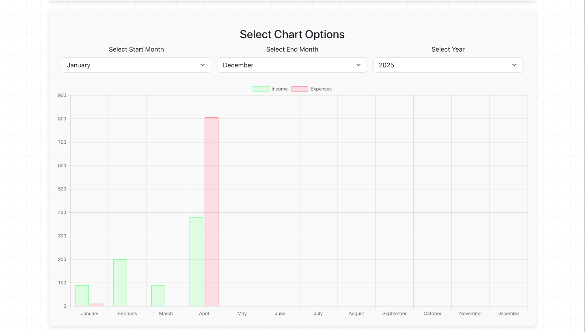
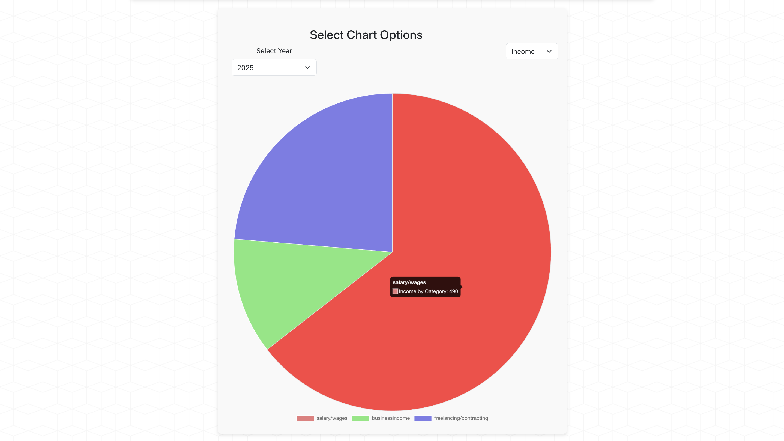

# 💸 Personal Finance Tracker

A full-stack finance dashboard that helps users manage and visualise their income and expenses with detailed analytics and chart visualisations. Built with React, Express, PostgreSQL, and Passport.js.

## ✨ Features

- 🔐 **Authentication**

  - Google OAuth and local email/password sign-in
  - Session handling with Passport.js

- 💰 **Financial Tracking**

  - Add incomes and expenses with date, category, and description
  - View total balances, monthly summaries, and daily breakdowns

- 📊 **Analytics Dashboard**

  - Interactive bar chart for daily/monthly totals
  - Pie chart visualisation of spending by category
  - Filter by month and year

- 🧾 **Transaction History**
  - View, search, and filter transactions
  - Categorised breakdown of incomes and expenses

## 🧱 Tech Stack

| Frontend     | Backend    | Database   | Auth                 | Charts   |
| ------------ | ---------- | ---------- | -------------------- | -------- |
| React        | Express.js | PostgreSQL | Passport.js          | Recharts |
| Tailwind CSS | Node.js    | Prisma/pg  | Google OAuth & Local |          |

## 📁 Project Structure

```
client/               # React frontend
  └── components/     # Reusable UI components (BarChart, PieChart, etc.)
  └── pages/          # Main views and dashboard
  └── utils/          # Helpers and formatters

/               # Express backend
  └── src/         # index.js server
```

## 📸 Screenshots

#### Dashboard View



#### Bar Chart Example



#### Pie Chart Example



## 🚀 Getting Started

### 1. Clone the repo

```bash
git clone https://github.com/Dempsey845/Fracker.git
cd fracker
```

### 2. Set up the server

```bash
npm install
```

- Create a `.env` file with your DB URL, session secret, and Google OAuth credentials.

### 3. Set up the client

```bash
cd client
npm install
npm run build
npm start
```

### 4. Run the server

```bash
cd ..
node src/index.js
```

## 🗂 Database Setup

To set up the database, follow these steps:

1. **Create the database in PostgreSQL** if it doesn't already exist:

```sql
CREATE DATABASE finance_tracker;
```

2. **Run the SQL commands below** to create the necessary tables:

```sql
-- Users table
CREATE TABLE users (
    id SERIAL PRIMARY KEY,
    username TEXT NOT NULL UNIQUE,
    email TEXT NOT NULL UNIQUE,
    password TEXT NOT NULL
);

-- Categories table
CREATE TABLE categories (
    id SERIAL PRIMARY KEY,
    user_id INTEGER NOT NULL,
    category_name TEXT NOT NULL,
    FOREIGN KEY (user_id) REFERENCES users(id) ON DELETE CASCADE
);

-- Incomes table
CREATE TABLE incomes (
    id SERIAL PRIMARY KEY,
    user_id INTEGER NOT NULL,
    amount NUMERIC(10, 2) NOT NULL,
    FOREIGN KEY (user_id) REFERENCES users(id) ON DELETE CASCADE
);

-- Expenses table
CREATE TABLE expenses (
    id SERIAL PRIMARY KEY,
    user_id INTEGER NOT NULL,
    amount NUMERIC(10, 2) NOT NULL,
    FOREIGN KEY (user_id) REFERENCES users(id) ON DELETE CASCADE
);

-- Add category and note to expenses
ALTER TABLE expenses ADD COLUMN category_id INTEGER;
ALTER TABLE expenses ADD COLUMN note TEXT;
ALTER TABLE expenses ADD FOREIGN KEY (category_id) REFERENCES categories(id) ON DELETE SET NULL;

-- Add category and note to incomes
ALTER TABLE incomes ADD COLUMN category_id INTEGER;
ALTER TABLE incomes ADD COLUMN note TEXT;
ALTER TABLE incomes ADD FOREIGN KEY (category_id) REFERENCES categories(id) ON DELETE SET NULL;

-- User preferences
CREATE TABLE user_preferences (
    id SERIAL PRIMARY KEY,
    user_id INTEGER NOT NULL,
    currency TEXT DEFAULT 'GBP',
    dark_mode BOOLEAN DEFAULT FALSE,
    FOREIGN KEY (user_id) REFERENCES users(id) ON DELETE CASCADE
);

-- Add date and created_at columns to expenses and incomes
ALTER TABLE expenses ADD COLUMN date DATE NOT NULL DEFAULT CURRENT_DATE;
ALTER TABLE expenses ADD COLUMN created_at TIMESTAMP DEFAULT CURRENT_TIMESTAMP;

ALTER TABLE incomes ADD COLUMN date DATE NOT NULL DEFAULT CURRENT_DATE;
ALTER TABLE incomes ADD COLUMN created_at TIMESTAMP DEFAULT CURRENT_TIMESTAMP;

-- Remove unnecessary username column from users table
ALTER TABLE users DROP COLUMN username;

-- Session table for storing session data
CREATE TABLE "session" (
  "sid" varchar NOT NULL COLLATE "default",
  "sess" json NOT NULL,
  "expire" timestamp(6) NOT NULL
)
WITH (OIDS=FALSE);
ALTER TABLE "session" ADD CONSTRAINT "session_pkey" PRIMARY KEY ("sid");
CREATE INDEX "IDX_session_expire" ON "session" ("expire");

-- Drop the foreign key constraints on expenses and incomes
ALTER TABLE expenses DROP CONSTRAINT IF EXISTS expenses_category_id_fkey;
ALTER TABLE incomes DROP CONSTRAINT IF EXISTS incomes_category_id_fkey;

-- Remove category_id column from expenses and incomes
ALTER TABLE expenses DROP COLUMN IF EXISTS category_id;
ALTER TABLE incomes DROP COLUMN IF EXISTS category_id;

-- Drop the categories table
DROP TABLE IF EXISTS categories;

-- Add 'category' column to the 'incomes' table
ALTER TABLE incomes ADD COLUMN category TEXT NOT NULL;

-- Add 'category' column to the 'expenses' table
ALTER TABLE expenses ADD COLUMN category TEXT NOT NULL;
```

3. **Ensure the database schema is set up properly:**

After running the above SQL queries, make sure the tables and their relationships are created as expected.

```

## 🛡️ Security & Auth

- User sessions stored securely with express-session
- Passwords hashed with bcrypt
- OAuth handled via Google strategy

## 📅 Upcoming Features

- Budget setting and goals
- Export to CSV

## 🤝 Contributing

Pull requests welcome! If you spot any bugs or have ideas for improvements, feel free to open an issue or PR.

## 📄 License

MIT License

---

**Made with ❤️ by Dempsey Newton**
```
